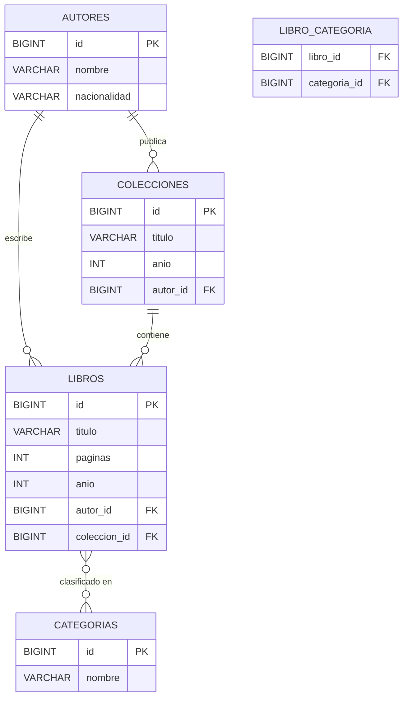
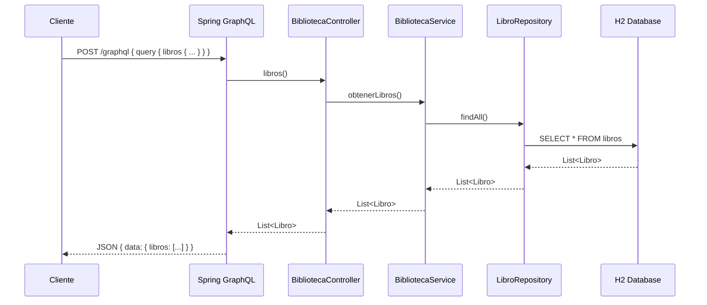
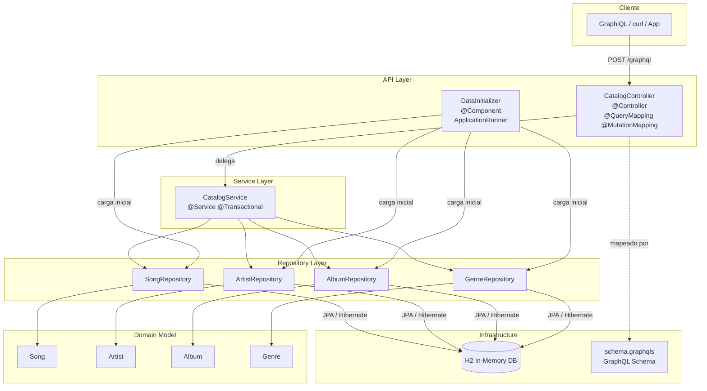
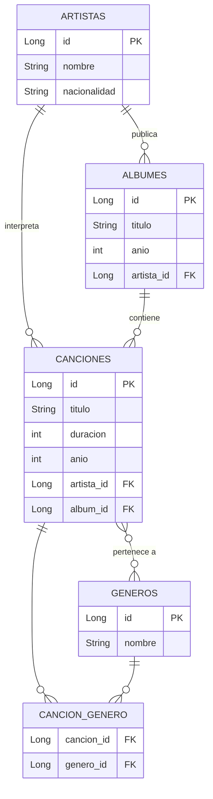
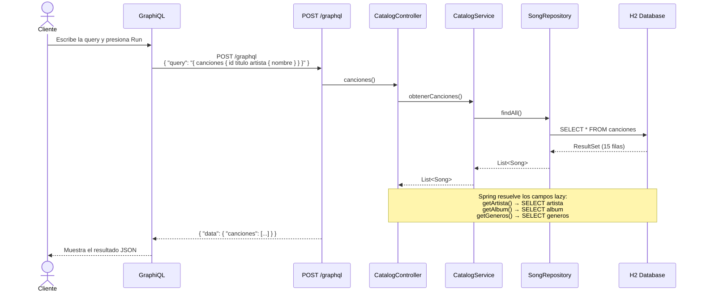
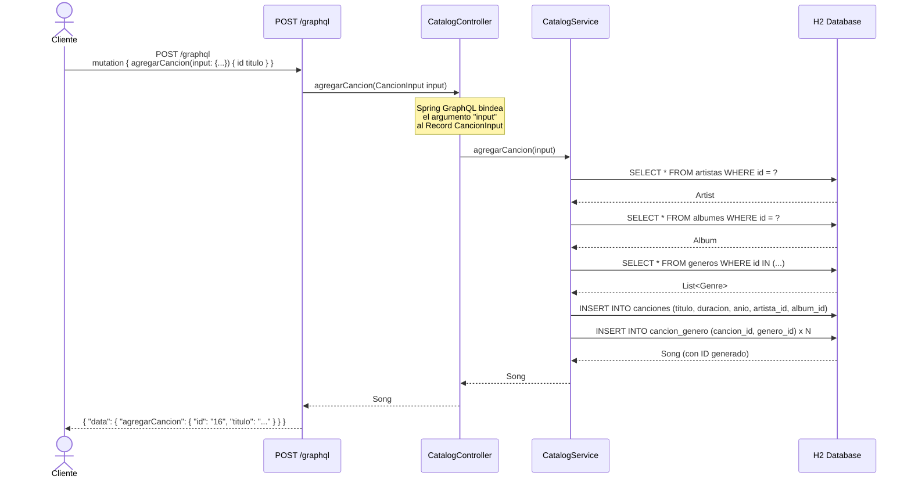

# 📚 Catálogo de Libros — POC

API GraphQL para la gestión de un catálogo bibliográfico. Proyecto de prueba de concepto (POC) que demuestra la integración de **Spring Boot 3**, **Spring GraphQL**, **Spring Data JPA** y **H2 en memoria**.

---

## Stack Tecnológico

| Tecnología          | Versión | Rol                                         |
|---------------------|---------|---------------------------------------------|
| **Java**            | 21      | Lenguaje (Records, Pattern Matching)        |
| **Spring Boot**     | 3.3.x   | Framework principal y auto-configuración    |
| **Spring GraphQL**  | 1.3.x   | Exposición de la API GraphQL vía HTTP       |
| **Spring Data JPA** | 3.x     | Abstracción del acceso a datos              |
| **Hibernate**       | 6.x     | ORM — implementación JPA                    |
| **H2 Database**     | 2.x     | Base de datos relacional en memoria         |
| **Maven**           | 3.x     | Gestor de dependencias y build              |

---

## Arquitectura de Capas

```
┌───────────────────────────────────────────────────┐
│         Cliente (Navegador / GraphiQL / curl)      │
└──────────────────────┬────────────────────────────┘
                       │  HTTP POST /graphql
                       ▼
┌───────────────────────────────────────────────────┐
│              Capa de Presentación                  │
│  BibliotecaController (@Controller)                │
│  @QueryMapping / @MutationMapping                  │
└──────────────────────┬────────────────────────────┘
                       │
                       ▼
┌───────────────────────────────────────────────────┐
│              Capa de Negocio                       │
│  BibliotecaService (@Service)                      │
│  Lógica de dominio y validaciones                  │
└──────────────────────┬────────────────────────────┘
                       │
                       ▼
┌───────────────────────────────────────────────────┐
│              Capa de Acceso a Datos                │
│  LibroRepository / AutorRepository                 │
│  ColeccionRepository / CategoriaRepository         │
│  (Spring Data JPA — JpaRepository)                 │
└──────────────────────┬────────────────────────────┘
                       │
                       ▼
┌───────────────────────────────────────────────────┐
│         H2 Database (en memoria)                   │
│  jdbc:h2:mem:librosdb                              │
│  Tablas: libros, autores, colecciones, categorias  │
│          libro_categoria (join table)              │
└───────────────────────────────────────────────────┘
```

---

## Diagrama de Componentes

```mermaid
graph TD
    A[Cliente / GraphiQL] -->|HTTP POST /graphql| B[BibliotecaController]
    B --> C[BibliotecaService]
    C --> D[LibroRepository]
    C --> E[AutorRepository]
    C --> F[ColeccionRepository]
    C --> G[CategoriaRepository]
    D --> H[(H2 — librosdb)]
    E --> H
    F --> H
    G --> H
    I[DataInitializer] -->|@ApplicationRunner| C
```

---

## Modelo Entidad-Relación



---

## Datos de Prueba

Al iniciar la aplicación, `DataInitializer` carga automáticamente:

| Entidad     | Cantidad | Ejemplos                                                    |
|-------------|----------|-------------------------------------------------------------|
| Categorías  | 5        | Realismo Mágico, Fantasía, Terror, Romance, Aventura        |
| Autores     | 5        | García Márquez, J.K. Rowling, Tolkien, Allende, Stephen King |
| Colecciones | 5        | Harry Potter, El Señor de los Anillos, La Torre Oscura...   |
| Libros      | 15       | 3 libros por autor                                          |

---

## Endpoints

| Endpoint          | Método | Descripción                              |
|-------------------|--------|------------------------------------------|
| `/graphql`        | POST   | Endpoint principal de la API GraphQL     |
| `/graphiql`       | GET    | Playground interactivo GraphQL (UI)      |
| `/h2-console`     | GET    | Consola web H2 (base de datos)           |

**Puerto:** `8085`

---

## Cómo Ejecutar

### Con Maven

```bash
# Compilar y ejecutar
mvn spring-boot:run

# Ejecutar los tests
mvn test
```

La aplicación iniciará en `http://localhost:8085`

### Con Docker

```bash
# Construir la imagen
docker build -t libros-poc .

# Ejecutar el contenedor
docker run -p 8085:8085 libros-poc
```

### Con Docker Compose

```bash
docker-compose up --build
```

---

## Ejemplos de Operaciones GraphQL

Abre **GraphiQL** en `http://localhost:8085/graphiql` y prueba las siguientes operaciones:

### Queries

**Consultar todos los libros**
```graphql
query {
  libros {
    id
    titulo
    paginas
    anio
    autor {
      nombre
      nacionalidad
    }
    coleccion {
      titulo
    }
    categorias {
      nombre
    }
  }
}
```

**Buscar un libro por ID**
```graphql
query {
  libro(id: 1) {
    titulo
    paginas
    anio
    autor { nombre }
    categorias { nombre }
  }
}
```

**Consultar todos los autores con sus libros**
```graphql
query {
  autores {
    id
    nombre
    nacionalidad
    libros {
      titulo
      paginas
    }
    colecciones {
      titulo
      anio
    }
  }
}
```

**Consultar todas las colecciones**
```graphql
query {
  colecciones {
    id
    titulo
    anio
    autor { nombre }
    libros { titulo }
  }
}
```

**Consultar categorías con sus libros**
```graphql
query {
  categorias {
    nombre
    libros {
      titulo
      anio
    }
  }
}
```

### Mutations

**Agregar un nuevo libro**
```graphql
mutation {
  agregarLibro(input: {
    titulo: "El Otoño del Patriarca"
    paginas: 317
    anio: 1975
    autorId: "1"
    coleccionId: "1"
    categoriaIds: ["1"]
  }) {
    id
    titulo
    paginas
    anio
    autor { nombre }
    coleccion { titulo }
    categorias { nombre }
  }
}
```

**Agregar un nuevo autor**
```graphql
mutation {
  agregarAutor(input: {
    nombre: "Jorge Luis Borges"
    nacionalidad: "Argentina"
  }) {
    id
    nombre
    nacionalidad
  }
}
```

**Agregar una nueva colección**
```graphql
mutation {
  agregarColeccion(input: {
    titulo: "Ficciones"
    anio: 1944
    autorId: "6"
  }) {
    id
    titulo
    anio
    autor { nombre }
  }
}
```

**Eliminar un libro**
```graphql
mutation {
  eliminarLibro(id: 1)
}
```

---

## Estructura del Proyecto

```
src/
├── main/
│   ├── java/com/canciones/
│   │   ├── LibrosPocApplication.java       ← Clase principal (@SpringBootApplication)
│   │   ├── DataInitializer.java            ← Carga datos al iniciar
│   │   ├── model/
│   │   │   ├── Libro.java                  ← Entidad JPA Libro
│   │   │   ├── Autor.java                  ← Entidad JPA Autor
│   │   │   ├── Coleccion.java              ← Entidad JPA Colección/Saga
│   │   │   └── Categoria.java             ← Entidad JPA Categoría
│   │   ├── repository/
│   │   │   ├── LibroRepository.java        ← Spring Data JPA
│   │   │   ├── AutorRepository.java
│   │   │   ├── ColeccionRepository.java
│   │   │   └── CategoriaRepository.java
│   │   ├── dto/
│   │   │   ├── LibroInput.java             ← Java 21 Record
│   │   │   ├── AutorInput.java
│   │   │   └── ColeccionInput.java
│   │   ├── service/
│   │   │   └── BibliotecaService.java      ← Lógica de negocio
│   │   └── controller/
│   │       └── BibliotecaController.java   ← Resolvers GraphQL
│   └── resources/
│       ├── graphql/
│       │   └── schema.graphqls             ← Schema GraphQL
│       └── application.properties          ← Configuración
├── Dockerfile
└── docker-compose.yml
```

---

## Acceso a la Consola H2

1. Abre `http://localhost:8085/h2-console`
2. Usa los siguientes datos de conexión:
   - **JDBC URL:** `jdbc:h2:mem:librosdb`
   - **Usuario:** `sa`
   - **Contraseña:** *(vacía)*

---

## Diagrama de Flujo — Query `libros`




---

## Stack Tecnológico

| Tecnología         | Versión  | Rol                                          |
|--------------------|----------|----------------------------------------------|
| **Java**           | 21       | Lenguaje (Records, Pattern Matching)         |
| **Spring Boot**    | 3.3.x    | Framework principal y auto-configuración     |
| **Spring GraphQL** | 1.3.x    | Exposición de la API GraphQL vía HTTP        |
| **Spring Data JPA**| 3.x      | Abstracción del acceso a datos               |
| **Hibernate**      | 6.x      | ORM — implementación JPA                     |
| **H2 Database**    | 2.x      | Base de datos relacional en memoria          |
| **Maven**          | 3.x      | Gestor de dependencias y build               |

---

## Arquitectura de Capas

```
┌───────────────────────────────────────────────────┐
│         Cliente (Navegador / GraphiQL / curl)      │
└──────────────────────┬────────────────────────────┘
                       │  HTTP POST /graphql
                       ▼
┌───────────────────────────────────────────────────┐
│              Capa de Presentación                  │
│         CatalogController  (@Controller)           │
│    @QueryMapping   →  resuelve consultas           │
│    @MutationMapping → resuelve mutaciones          │
│    @Argument        → binding de argumentos        │
└──────────────────────┬────────────────────────────┘
                       │
                       ▼
┌───────────────────────────────────────────────────┐
│              Capa de Servicio                      │
│           CatalogService  (@Service)               │
│    Lógica de negocio + @Transactional              │
│    Valida entidades, arma el grafo de objetos      │
└──────────────────────┬────────────────────────────┘
                       │
                       ▼
┌───────────────────────────────────────────────────┐
│            Capa de Repositorio                     │
│   ArtistRepository  AlbumRepository               │
│   SongRepository    GenreRepository               │
│        (extienden JpaRepository<T, Long>)          │
└──────────────────────┬────────────────────────────┘
                       │  SQL generado por Hibernate
                       ▼
┌───────────────────────────────────────────────────┐
│          Base de Datos H2 (en memoria)             │
│   artistas │ albumes │ canciones │ generos         │
│                cancion_genero (join)               │
└───────────────────────────────────────────────────┘
```

---

## Diagrama de Componentes



---

## Modelo de Dominio y Relaciones JPA



---

## Diagrama de Secuencia — Query `canciones`



---

## Diagrama de Secuencia — Mutation `agregarCancion`



---

## Endpoints Expuestos

| Endpoint              | Método | Descripción                                        |
|-----------------------|--------|----------------------------------------------------|
| `/graphql`            | POST   | Endpoint principal de la API GraphQL               |
| `/graphiql`           | GET    | UI interactiva para explorar y probar la API       |
| `/h2-console`         | GET    | Consola web de la base de datos H2                 |

---

## Flujo Básico de Ejemplo

Escenario: consultar las canciones de Queen con sus géneros.

```
1. El cliente envía POST /graphql con la query
2. Spring GraphQL enruta la operación al método canciones() del CatalogController
3. El controlador delega en CatalogService.obtenerCanciones()
4. El servicio llama a SongRepository.findAll() (transacción de solo lectura)
5. Hibernate genera: SELECT * FROM canciones
6. Spring GraphQL resuelve cada campo del resultado:
   - song.getTitulo()   → "Bohemian Rhapsody"
   - song.getArtista()  → lazy load → SELECT * FROM artistas WHERE id = 3
   - song.getGeneros()  → lazy load → SELECT generos JOIN cancion_genero ...
7. El resultado se serializa a JSON y se retorna al cliente
```

---

## Cómo Ejecutar el Proyecto

### Prerequisitos

- **Java 21** o superior instalado
- **Maven 3.8+** instalado (o usar el Maven Wrapper si se agrega)

### Pasos

```bash
# 1. Clonar o abrir el proyecto
cd canciones-poc

# 2. Compilar el proyecto
mvn clean compile

# 3. Ejecutar la aplicación
mvn spring-boot:run
```

La aplicación estará disponible en `http://localhost:8085`.

### Acceso a las herramientas

| Herramienta  | URL                                      | Notas                              |
|--------------|------------------------------------------|------------------------------------|
| GraphiQL UI  | http://localhost:8085/graphiql           | Explorador interactivo de GraphQL  |
| H2 Console   | http://localhost:8085/h2-console         | Ver tablas y ejecutar SQL          |
| API GraphQL  | http://localhost:8085/graphql (POST)     | Endpoint directo para clientes     |

**Configuración de la consola H2:**
- JDBC URL: `jdbc:h2:mem:cancionesdb`
- Usuario: `sa`
- Contraseña: *(vacía)*

### Con Docker

```bash
# Construir la imagen y levantar el contenedor en el puerto 8085
docker compose up --build

# Correr en segundo plano
docker compose up --build -d

# Detener
docker compose down
```

O directamente con Docker:

```bash
# Construir la imagen
docker build -t canciones-poc .

# Levantar el contenedor en el puerto 8085
docker run -p 8085:8085 --name canciones-poc canciones-poc
```

La aplicación estará disponible en `http://localhost:8085` en ambos casos.

---

## Ejemplos de Queries y Mutations para GraphiQL

### QUERIES — Consultas

#### 1. Obtener todas las canciones con artista y géneros
```graphql
query TodasLasCanciones {
  canciones {
    id
    titulo
    duracion
    anio
    artista {
      nombre
      nacionalidad
    }
    album {
      titulo
    }
    generos {
      nombre
    }
  }
}
```

#### 2. Obtener una canción por ID
```graphql
query CancionPorId {
  cancion(id: "1") {
    id
    titulo
    duracion
    anio
    artista {
      nombre
    }
    generos {
      nombre
    }
  }
}
```

#### 3. Obtener todos los artistas con sus álbumes y canciones
```graphql
query TodosLosArtistas {
  artistas {
    id
    nombre
    nacionalidad
    albumes {
      titulo
      anio
    }
    canciones {
      titulo
      duracion
    }
  }
}
```

#### 4. Obtener un artista específico por ID
```graphql
query ArtistaPorId {
  artista(id: "3") {
    nombre
    nacionalidad
    canciones {
      titulo
      duracion
      generos {
        nombre
      }
    }
  }
}
```

#### 5. Obtener todos los álbumes con sus canciones
```graphql
query TodosLosAlbumes {
  albumes {
    id
    titulo
    anio
    artista {
      nombre
    }
    canciones {
      titulo
    }
  }
}
```

#### 6. Obtener un álbum específico
```graphql
query AlbumPorId {
  album(id: "2") {
    titulo
    anio
    artista {
      nombre
    }
    canciones {
      titulo
      duracion
    }
  }
}
```

#### 7. Obtener todos los géneros con sus canciones
```graphql
query TodosLosGeneros {
  generos {
    id
    nombre
    canciones {
      titulo
      artista {
        nombre
      }
    }
  }
}
```

---

### MUTATIONS — Modificaciones

#### 8. Agregar un nuevo artista
```graphql
mutation AgregarArtista {
  agregarArtista(input: {
    nombre: "Coldplay"
    nacionalidad: "Británica"
  }) {
    id
    nombre
    nacionalidad
  }
}
```

#### 9. Agregar un nuevo álbum (usa el ID del artista creado en el paso anterior)
```graphql
mutation AgregarAlbum {
  agregarAlbum(input: {
    titulo: "A Head Full of Dreams"
    anio: 2015
    artistaId: "6"
  }) {
    id
    titulo
    anio
    artista {
      nombre
    }
  }
}
```

#### 10. Agregar una nueva canción
```graphql
mutation AgregarCancion {
  agregarCancion(input: {
    titulo: "Adventure of a Lifetime"
    duracion: 245
    anio: 2015
    artistaId: "6"
    albumId: "6"
    generoIds: ["2"]
  }) {
    id
    titulo
    duracion
    anio
    artista {
      nombre
    }
    album {
      titulo
    }
    generos {
      nombre
    }
  }
}
```

#### 11. Agregar una canción sin álbum y sin géneros (campos opcionales)
```graphql
mutation AgregarCancionMinima {
  agregarCancion(input: {
    titulo: "Canción de Prueba"
    duracion: 180
    anio: 2024
    artistaId: "1"
  }) {
    id
    titulo
    artista {
      nombre
    }
  }
}
```

#### 12. Eliminar una canción por ID
```graphql
mutation EliminarCancion {
  eliminarCancion(id: "1")
}
```

---

## Estructura del Proyecto

```
canciones-poc/
├── pom.xml                                          # Dependencias Maven
├── Dockerfile                                       # Build multi-etapa, JRE Alpine, puerto 8085
├── docker-compose.yml                               # Levanta el servicio en puerto 8085
├── README.md                                        # Este archivo
└── src/
    └── main/
        ├── java/com/canciones/
        │   ├── CancionesPocApplication.java         # Punto de entrada Spring Boot
        │   ├── DataInitializer.java                 # Carga datos de prueba al inicio
        │   ├── controller/
        │   │   └── CatalogController.java           # Resolvers GraphQL (@QueryMapping / @MutationMapping)
        │   ├── service/
        │   │   └── CatalogService.java              # Lógica de negocio (@Transactional)
        │   ├── repository/
        │   │   ├── ArtistRepository.java            # Repositorio JPA para Artist
        │   │   ├── AlbumRepository.java             # Repositorio JPA para Album
        │   │   ├── SongRepository.java              # Repositorio JPA para Song
        │   │   └── GenreRepository.java             # Repositorio JPA para Genre
        │   ├── model/
        │   │   ├── Artist.java                      # Entidad: Artista (@ManyToOne, @OneToMany)
        │   │   ├── Album.java                       # Entidad: Álbum (@ManyToOne, @OneToMany)
        │   │   ├── Song.java                        # Entidad: Canción (@ManyToOne, @ManyToMany)
        │   │   └── Genre.java                       # Entidad: Género (@ManyToMany inverso)
        │   └── dto/
        │       ├── CancionInput.java                # Record Java 21: input para crear canción
        │       ├── ArtistaInput.java                # Record Java 21: input para crear artista
        │       └── AlbumInput.java                  # Record Java 21: input para crear álbum
        └── resources/
            ├── application.properties               # Configuración de H2, JPA y GraphQL
            └── graphql/
                └── schema.graphqls                  # Schema GraphQL (tipos, queries, mutations, inputs)
```

---

## Notas de Diseño

### Uso de Java Records para Input Types
Los DTOs de entrada (`CancionInput`, `ArtistaInput`, `AlbumInput`) son Records de Java 21. Esto garantiza:
- **Inmutabilidad**: los campos son `final` implícitamente.
- **Concisión**: sin boilerplate de constructores/getters.
- **Binding automático**: Spring GraphQL (vía `@Argument`) instancia los Records usando su constructor canónico, mapeando los campos del Input Type GraphQL a los componentes del Record.

### Lazy Loading con Open-in-View
La propiedad `spring.jpa.open-in-view=true` mantiene la sesión JPA activa durante todo el ciclo de vida del request HTTP. Esto permite que el motor de ejecución GraphQL resuelva las relaciones lazy (`@OneToMany`, `@ManyToMany`) de forma transparente cuando construye la respuesta.

### Datos de Prueba Precargados
Al iniciar la aplicación, `DataInitializer` carga automáticamente:

| Entidad   | Cantidad | Ejemplos                                      |
|-----------|----------|-----------------------------------------------|
| Géneros   | 5        | Rock Clásico, Pop, R&B/Soul, Reggae, Pop Latino |
| Artistas  | 5        | The Beatles, Michael Jackson, Queen, Bob Marley, Shakira |
| Álbumes   | 5        | Abbey Road, Thriller, A Night at the Opera, Legend, Laundry Service |
| Canciones | 15       | Come Together, Billie Jean, Bohemian Rhapsody... |
