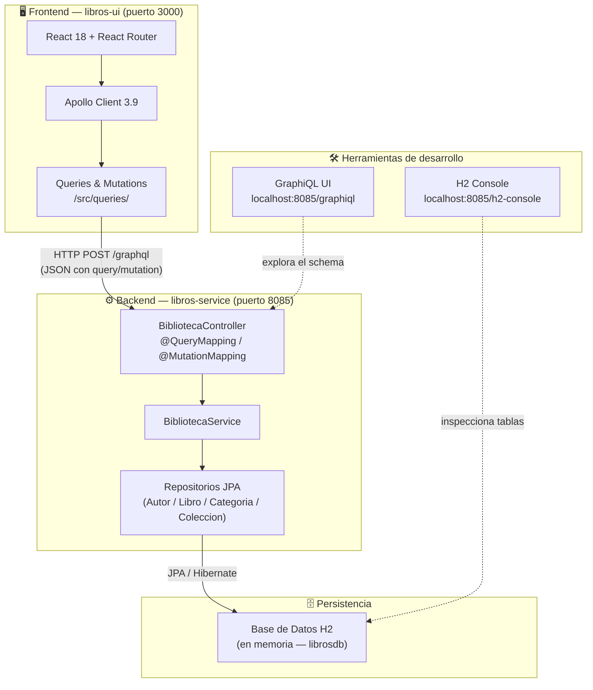

# 📚 Libros POC — Catálogo de Libros con GraphQL

POC (**Proof of Concept**) que demuestra una arquitectura fullstack moderna basada en **GraphQL** como contrato de comunicación entre capas. El sistema implementa un catálogo bibliográfico con operaciones de consulta y mutación, cubriendo las ventajas clave de GraphQL frente a REST en un caso de uso real.

---

## 🏛️ Diagrama de Arquitectura



### Flujo de una petición GraphQL

```
Browser (React)
   │
   │  POST http://localhost:8085/graphql
   │  Content-Type: application/json
   │  Body: { "query": "{ libros { id titulo } }" }
   │
   ▼
Apollo Client  ──►  Spring GraphQL (DispatcherServlet)
                         │
                         ▼
                   BibliotecaController   (@QueryMapping)
                         │
                         ▼
                   BibliotecaService      (lógica de negocio)
                         │
                         ▼
                   LibroRepository        (Spring Data JPA)
                         │
                         ▼
                   H2 Database            (SQL generado por Hibernate)
                         │
                    ◄────┘
                   JSON Response
   ◄──────────────────────────────────
```

---

## 🛠️ Stack Tecnológico

### Backend

| Tecnología | Versión | Rol |
|---|---|---|
| Java | 21 | Lenguaje principal |
| Spring Boot | 3.3.1 | Framework de aplicación |
| Spring GraphQL | 1.3.x _(BOM de Boot)_ | Servidor GraphQL sobre HTTP |
| graphql-java | 22.x _(BOM de Boot)_ | Motor de ejecución GraphQL |
| Spring Data JPA | 3.3.1 | Abstracción de repositorios ORM |
| Hibernate | 6.5.x _(BOM de Boot)_ | Implementación JPA / ORM |
| H2 Database | 2.x _(BOM de Boot)_ | BD relacional en memoria |
| Maven | 3.x | Gestor de dependencias y build |

### Frontend

| Tecnología | Versión | Rol |
|---|---|---|
| React | 18.2.0 | Librería de UI |
| Vite | 5.1.3 | Bundler y servidor de desarrollo |
| Apollo Client | 3.9.6 | Cliente GraphQL + caché reactiva |
| graphql | 16.8.1 | Parser de documentos GraphQL |
| React Router DOM | 6.22.1 | Enrutamiento SPA |
| TailwindCSS | 3.4.1 | Framework CSS utility-first |
| PostCSS / Autoprefixer | 8.4 / 10.4 | Procesamiento de CSS |
| Node.js | 18+ | Runtime para herramientas frontend |

---

## 📂 Estructura del Proyecto

```
libros-poc/
│
├── libros-service/                          # Backend Spring Boot
│   ├── pom.xml
│   ├── Dockerfile
│   ├── docker-compose.yml
│   └── src/
│       └── main/
│           ├── java/com/libros/
│           │   ├── LibrosPocApplication.java        # Punto de entrada
│           │   ├── DataInitializer.java             # Carga datos de prueba (15 libros)
│           │   ├── config/
│           │   │   └── CorsConfig.java              # CORS para localhost:3000
│           │   ├── controller/
│           │   │   └── BibliotecaController.java    # @QueryMapping / @MutationMapping
│           │   ├── dto/
│           │   │   ├── LibroInput.java              # Record para mutation agregarLibro
│           │   │   ├── AutorInput.java              # Record para mutation agregarAutor
│           │   │   └── ColeccionInput.java          # Record para mutation agregarColeccion
│           │   ├── model/
│           │   │   ├── Libro.java                   # Entidad JPA
│           │   │   ├── Autor.java
│           │   │   ├── Coleccion.java
│           │   │   └── Categoria.java
│           │   ├── repository/
│           │   │   ├── LibroRepository.java         # Spring Data JPA
│           │   │   ├── AutorRepository.java
│           │   │   ├── ColeccionRepository.java
│           │   │   └── CategoriaRepository.java
│           │   └── service/
│           │       └── BibliotecaService.java       # Lógica de negocio
│           └── resources/
│               ├── application.properties           # Configuración Spring Boot
│               └── graphql/
│                   └── schema.graphqls              # Definición del schema GraphQL
│
└── libros-ui/                               # Frontend React
    ├── package.json
    ├── vite.config.js
    ├── tailwind.config.js
    ├── postcss.config.js
    ├── index.html
    └── src/
        ├── main.jsx                         # Punto de entrada: ApolloProvider + Router
        ├── App.jsx                          # Definición de rutas
        ├── index.css                        # Directivas Tailwind
        ├── apollo/
        │   └── client.js                    # Configuración Apollo Client → :8085/graphql
        ├── queries/
        │   ├── libros.js                    # GET_LIBROS, GET_LIBRO
        │   ├── autores.js                   # GET_AUTORES, GET_AUTOR
        │   ├── categorias.js                # GET_CATEGORIAS, GET_CATEGORIAS_CON_LIBROS
        │   └── mutations.js                 # AGREGAR_LIBRO, ELIMINAR_LIBRO, …
        ├── components/
        │   ├── Navbar.jsx                   # Barra de navegación
        │   ├── LoadingSpinner.jsx           # Estado de carga
        │   └── ErrorMessage.jsx            # Visualización de errores
        └── pages/
            ├── Home.jsx                     # 📚 Catálogo de libros
            ├── LibroDetalle.jsx             # 🔎 Búsqueda y detalle de libro
            ├── AutorDetalle.jsx             # 👤 Búsqueda y detalle de autor
            ├── FiltrarGenero.jsx            # 🏷️ Filtrar libros por género
            └── AgregarLibro.jsx             # ➕ Formulario para agregar libro
```

---

## ✅ Requisitos Previos

| Herramienta | Versión mínima | Verificar |
|---|---|---|
| Java JDK | 21 | `java -version` |
| Maven | 3.8+ | `mvn -version` |
| Node.js | 18+ | `node -v` |
| npm | 9+ | `npm -v` |

> **Nota:** No se requiere base de datos externa. H2 corre en memoria y se inicializa automáticamente con 15 libros de prueba al arrancar el backend.

---

## 🚀 Instalación y Ejecución

### 1. Clonar el repositorio

```bash
git clone <url-del-repositorio>
cd libros-poc
```

### 2. Levantar el Backend (libros-service)

```bash
cd libros-service
mvn spring-boot:run
```

Indicadores de inicio exitoso en consola:

```
Started LibrosPocApplication in XX seconds
✅ 15 libros cargados. GraphiQL: http://localhost:8085/graphiql
```

El backend estará disponible en `http://localhost:8085`.

### 3. Levantar el Frontend (libros-ui)

En una **nueva terminal**:

```bash
cd libros-ui
npm install        # solo la primera vez
npm run dev
```

Salida esperada:

```
  VITE v5.x.x  ready in XXXX ms
  ➜  Local:   http://localhost:3000/
```

### 4. (Alternativa) Docker Compose

```bash
cd libros-service
docker-compose up --build
```

---

## 🔗 URLs Importantes

| Recurso | URL | Descripción |
|---|---|---|
| **Frontend React** | http://localhost:3000 | Aplicación web completa |
| **GraphiQL UI** | http://localhost:8085/graphiql | IDE interactivo para explorar el schema y ejecutar queries |
| **Endpoint GraphQL** | http://localhost:8085/graphql | POST — usado por Apollo Client |
| **H2 Console** | http://localhost:8085/h2-console | Consola web para inspeccionar la BD en memoria |

> **H2 Console:** JDBC URL: `jdbc:h2:mem:librosdb` · Usuario: `sa` · Contraseña: _(vacía)_

---

## 📖 Flujo Funcional de Ejemplo

Todos los ejemplos se pueden ejecutar directamente en **GraphiQL** (`http://localhost:8085/graphiql`) o desde cualquier cliente HTTP con `POST http://localhost:8085/graphql`.

---

### Ejemplo 1 — Query: Obtener todos los libros

**Request:**
```graphql
query {
  libros {
    id
    titulo
    anio
    autor {
      nombre
    }
  }
}
```

**Response JSON:**
```json
{
  "data": {
    "libros": [
      {
        "id": "1",
        "titulo": "Cien Años de Soledad",
        "anio": 1967,
        "autor": { "nombre": "Gabriel García Márquez" }
      },
      {
        "id": "2",
        "titulo": "El Amor en los Tiempos del Cólera",
        "anio": 1985,
        "autor": { "nombre": "Gabriel García Márquez" }
      },
      {
        "id": "4",
        "titulo": "Harry Potter y la Piedra Filosofal",
        "anio": 1997,
        "autor": { "nombre": "J.K. Rowling" }
      }
    ]
  }
}
```

> 💡 **Ventaja GraphQL:** el cliente pide exactamente `id`, `titulo`, `anio` y `autor.nombre`. El servidor no devuelve `paginas`, `coleccion` ni `categorias`, que no fueron solicitados.

---

### Ejemplo 2 — Query anidada: Autor con sus libros y colecciones

**Request:**
```graphql
query {
  autor(id: "3") {
    nombre
    nacionalidad
    colecciones {
      titulo
      anio
    }
    libros {
      titulo
      paginas
      anio
      categorias {
        nombre
      }
    }
  }
}
```

**Response JSON:**
```json
{
  "data": {
    "autor": {
      "nombre": "J.R.R. Tolkien",
      "nacionalidad": "Sudafricana",
      "colecciones": [
        { "titulo": "El Señor de los Anillos", "anio": 1954 }
      ],
      "libros": [
        {
          "titulo": "El Hobbit",
          "paginas": 310,
          "anio": 1937,
          "categorias": [
            { "nombre": "Fantasía" },
            { "nombre": "Aventura" }
          ]
        },
        {
          "titulo": "La Comunidad del Anillo",
          "paginas": 479,
          "anio": 1954,
          "categorias": [
            { "nombre": "Fantasía" },
            { "nombre": "Aventura" }
          ]
        }
      ]
    }
  }
}
```

> 💡 **Ventaja GraphQL:** una sola petición resuelve tres niveles de relación (`autor → colecciones`, `autor → libros → categorias`). En REST equivaldría a 3 llamadas: `GET /autores/3`, `GET /autores/3/libros`, `GET /libros/{id}/categorias`.

---

### Ejemplo 3 — Filtrar: Libros de un género específico

**Request:**
```graphql
query {
  categorias {
    id
    nombre
    libros {
      titulo
      anio
      autor {
        nombre
      }
    }
  }
}
```

**Response JSON (fragmento — categoría "Fantasía"):**
```json
{
  "data": {
    "categorias": [
      {
        "id": "2",
        "nombre": "Fantasía",
        "libros": [
          {
            "titulo": "Harry Potter y la Piedra Filosofal",
            "anio": 1997,
            "autor": { "nombre": "J.K. Rowling" }
          },
          {
            "titulo": "El Hobbit",
            "anio": 1937,
            "autor": { "nombre": "J.R.R. Tolkien" }
          },
          {
            "titulo": "La Comunidad del Anillo",
            "anio": 1954,
            "autor": { "nombre": "J.R.R. Tolkien" }
          }
        ]
      }
    ]
  }
}
```

---

### Ejemplo 4 — Mutation: Agregar un nuevo libro

**Request:**
```graphql
mutation {
  agregarLibro(input: {
    titulo: "El nombre del viento"
    paginas: 662
    anio: 2007
    autorId: "1"
    categoriaIds: ["2", "5"]
  }) {
    id
    titulo
    anio
    autor {
      nombre
    }
    categorias {
      nombre
    }
  }
}
```

**Response JSON:**
```json
{
  "data": {
    "agregarLibro": {
      "id": "16",
      "titulo": "El nombre del viento",
      "anio": 2007,
      "autor": {
        "nombre": "Gabriel García Márquez"
      },
      "categorias": [
        { "nombre": "Fantasía" },
        { "nombre": "Aventura" }
      ]
    }
  }
}
```

> 💡 **Ventaja GraphQL:** la mutation devuelve exactamente los campos del objeto creado que el cliente necesita, sin necesidad de hacer un `GET` adicional para obtener el recurso recién creado (como ocurre en REST con el patrón `POST → 201 Created → Location header → GET`).

---

## ⚡ GraphQL vs REST — Ventajas en este proyecto

### 1. Un solo endpoint

| REST | GraphQL |
|---|---|
| `GET /libros` | `POST /graphql` |
| `GET /libros/{id}` | (mismo endpoint) |
| `GET /autores/{id}` | (mismo endpoint) |
| `GET /categorias` | (mismo endpoint) |
| `POST /libros` | (mismo endpoint) |

GraphQL centraliza todas las operaciones en `POST /graphql`. El **schema** funciona como contrato único y auto-documentado.

---

### 2. Elimina el over-fetching

En la pantalla **Inicio** solo se necesitan `titulo`, `anio` y `autor.nombre`. Con REST, `GET /libros` devolvería `paginas`, `coleccion`, `categorias` y todos los campos del autor — datos que la pantalla no usa.

```graphql
# Solo pedimos lo que la pantalla necesita
query {
  libros {
    titulo   # ✅ necesario
    anio     # ✅ necesario
    autor { nombre }  # ✅ necesario
    # paginas     ← no se pide, no se transfiere
    # coleccion   ← no se pide, no se transfiere
    # categorias  ← no se pide, no se transfiere
  }
}
```

---

### 3. Elimina el under-fetching (N+1 de red)

La pantalla **Detalle de Autor** necesita: datos del autor + sus libros + sus colecciones. Con REST serían **3 peticiones HTTP**:

```
REST:
  GET /autores/3           → datos del autor
  GET /autores/3/libros    → libros del autor
  GET /autores/3/colecciones → colecciones del autor

GraphQL:
  POST /graphql  (1 sola petición)
  {
    autor(id: "3") {
      nombre
      libros { titulo anio }
      colecciones { titulo anio }
    }
  }
```

---

### 4. Schema como contrato tipado

El archivo `schema.graphqls` define el contrato completo del API. Cualquier cliente puede inspeccionar qué queries, mutations y tipos están disponibles mediante **introspección** de GraphQL — sin necesidad de documentación externa (Swagger/OpenAPI).

```graphql
# El schema es la documentación viva del API
type Libro {
  id: ID!
  titulo: String!
  paginas: Int!
  anio: Int!
  autor: Autor!           # relación resuelta por el servidor
  coleccion: Coleccion    # nullable — no todos los libros pertenecen a una saga
  categorias: [Categoria!]!
}
```

---

### 5. Evolución sin versionado

Con REST, agregar un campo nuevo puede romper clientes. Con GraphQL, los campos nuevos se añaden al schema sin afectar a clientes existentes — estos simplemente no los piden hasta que lo necesiten.

---

## 🗃️ Datos de Prueba Iniciales

Al arrancar el backend se cargan automáticamente:

| Entidad | Cantidad | Ejemplos |
|---|---|---|
| Categorías | 5 | Realismo Mágico, Fantasía, Terror, Romance, Aventura |
| Autores | 5 | García Márquez, J.K. Rowling, Tolkien, Isabel Allende, Stephen King |
| Colecciones | 5 | Ciclo de Macondo, Harry Potter, El Señor de los Anillos, La Torre Oscura |
| Libros | 15 | Distribuidos entre los 5 autores con sus categorías asignadas |
